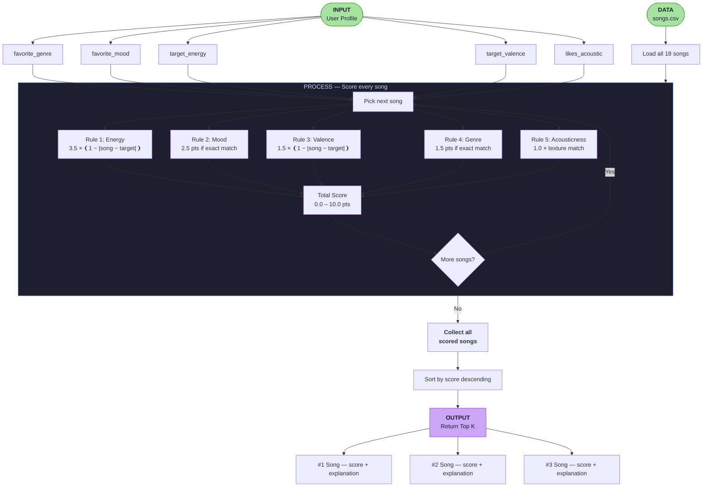
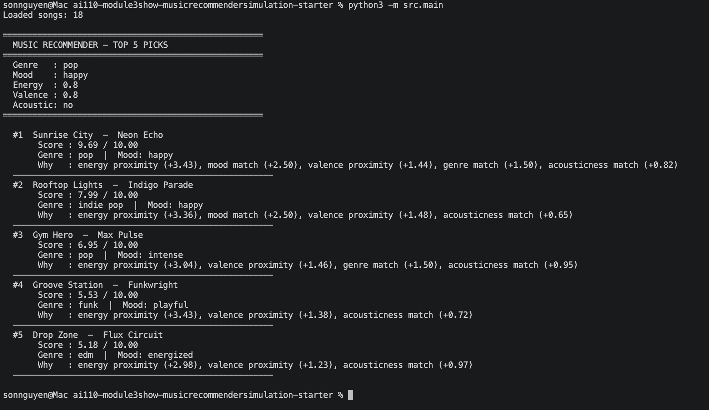
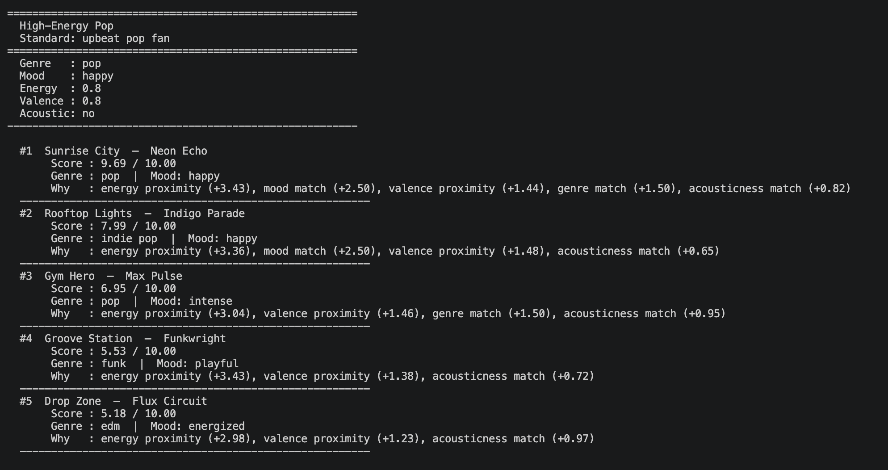
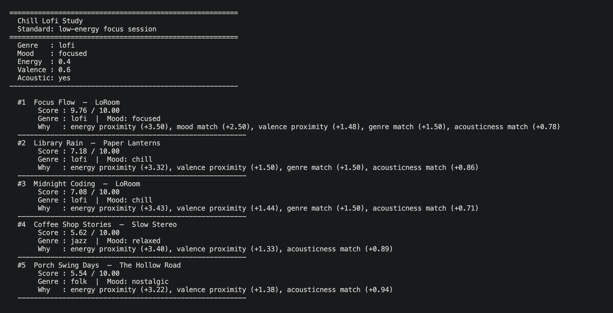

# 🎵 Music Recommender Simulation

## Project Summary

In this project you will build and explain a small music recommender system.

Your goal is to:

- Represent songs and a user "taste profile" as data
- Design a scoring rule that turns that data into recommendations
- Evaluate what your system gets right and wrong
- Reflect on how this mirrors real world AI recommenders

This simulation builds a content-based music recommender using a catalog of 18 songs from `data/songs.csv`. It represents each song as a structured object with audio features (energy, tempo, valence, acousticness) and descriptive labels (genre, mood). A user's taste is captured in a `UserProfile` with four fields: preferred genre, preferred mood, target energy level, and acoustic preference. The recommender scores every song against the user profile using a weighted formula — rewarding proximity on numerical features and exact matches on categorical ones — then returns the top-ranked results with a plain-language explanation of why each song was chosen.

---

## How The System Works

Real-world recommenders like Spotify and YouTube combine two approaches: collaborative filtering (what similar users enjoyed) and content-based filtering (what the music itself sounds like). This simulation focuses entirely on content-based filtering — it compares the audio and mood features of each song directly against a user's stated preferences using a weighted scoring formula. Rather than learning from thousands of users, it prioritizes matching the *feel* of a song to the user's current vibe. Energy and mood carry the most weight because they define how music *feels* physically and emotionally; genre acts as a secondary anchor, and acousticness fine-tunes texture preference. The result is a transparent, explainable system where every score can be traced back to specific feature matches.

### `Song` Features

| Feature | Type | What it captures |
|---|---|---|
| `id` | int | Unique identifier |
| `title` | str | Song name |
| `artist` | str | Artist name |
| `genre` | str | Musical category (pop, lofi, rock, jazz, ambient, synthwave, indie pop) |
| `mood` | str | Emotional label (happy, chill, intense, relaxed, focused, moody) |
| `energy` | float (0–1) | Physical intensity — calm vs. high-octane |
| `tempo_bpm` | float | Speed in beats per minute |
| `valence` | float (0–1) | Musical positivity — bright/happy vs. dark/melancholic |
| `danceability` | float (0–1) | Rhythmic groove and movement suitability |
| `acousticness` | float (0–1) | Organic/warm vs. electronic/synthetic texture |

### `UserProfile` Features

| Field | Type | What it captures |
|---|---|---|
| `favorite_genre` | str | Preferred genre to match against song genre |
| `favorite_mood` | str | Preferred mood to match against song mood |
| `target_energy` | float (0–1) | Desired intensity level |
| `likes_acoustic` | bool | Whether the user prefers acoustic over electronic sounds |
| `target_valence` | float (0–1) | Desired emotional brightness — happy/uplifting vs. dark/melancholic (default: 0.5) |

### Scoring & Ranking

Each song receives a score from 0.0 to 10.0 using a weighted point system:

```
score = (3.5 × energy proximity)
      + (2.5 × mood match)
      + (1.5 × valence proximity)
      + (1.5 × genre match)
      + (1.0 × acousticness match)
```

Proximity scores use `1 - abs(song_value - user_target)` so that songs *closest* to the user's preference score highest — not just the loudest or fastest. Categorical matches (mood, genre) are binary: full points for a match, 0 otherwise. All scored songs are sorted descending and the top `k` are returned.

### Data Flow Diagram



---

### Algorithm Recipe

The finalized scoring rules applied to every song in the catalog. Maximum total score is **10.0 points**.

| Rule | Feature | Max pts | Formula |
|---|---|---|---|
| 1 | `energy` | 3.5 | `3.5 × (1 − \|song.energy − user.target_energy\|)` |
| 2 | `mood` | 2.5 | `2.5 if song.mood == user.favorite_mood else 0.0` |
| 3 | `valence` | 1.5 | `1.5 × (1 − \|song.valence − user.target_valence\|)` |
| 4 | `genre` | 1.5 | `1.5 if song.genre == user.favorite_genre else 0.0` |
| 5 | `acousticness` | 1.0 | `1.0 × song.acousticness` if `likes_acoustic`, else `1.0 × (1 − song.acousticness)` |

**Why mood outweighs genre (2.5 vs 1.5):** A genre match with the wrong mood still produces a jarring listening experience. A mood match with the wrong genre is far more tolerable — users accept genre surprises but not vibe mismatches. Energy ranks highest because it is the strongest continuous signal across the entire catalog and defines the physical intensity axis most precisely.

**Ranking rule:** After all songs are scored, sort the list by total score descending and return the top `k` results, each paired with a plain-language explanation of which rules contributed most to its score.

---

### Known Biases & Limitations

These are expected weaknesses in the design — identified before implementation so they can be evaluated honestly during testing.

**1. Genre lock-in**
Cataloged genres are exact strings. A user who prefers `lofi` gets zero genre points for `ambient` or `jazz`, even though those genres are functionally nearly identical in this dataset. This will cause acoustically similar songs to score lower than they deserve.

**2. Single-mood brittleness**
The profile stores one `favorite_mood`. A user whose preferences shift during a session (e.g., starting focused, ending relaxed) gets no representation of that range. The system treats every recommendation as if the user is always in exactly one mood.

**3. Energy dominates edge cases**
At 3.5 points, energy can overpower mood on close calls. A song that perfectly matches mood but has slightly wrong energy will lose to a song that nails energy but misses mood entirely — if the energy gap is large enough. This may surface energetically correct but emotionally wrong results for users with strong mood preferences.

**4. No catalog diversity enforcement**
The ranking rule returns the top `k` by score, which can produce duplicate artists or a cluster of very similar songs. If the top 5 are all lofi tracks, a lofi user gets no exposure to related genres they might enjoy.

**5. Acousticness is binary in intent**
`likes_acoustic` is a `bool`, which means a user who "slightly prefers acoustic" is treated identically to one who "absolutely requires acoustic." This collapses a gradient preference into an on/off switch.

**6. Small catalog amplifies every bias**
With only 18 songs, a single feature mismatch (e.g., wrong genre) eliminates a large fraction of the catalog immediately. In a real system with millions of tracks, the top-k pool would be far more diverse.

---

## Getting Started

### Setup

1. Create a virtual environment (optional but recommended):

   ```bash
   python -m venv .venv
   source .venv/bin/activate      # Mac or Linux
   .venv\Scripts\activate         # Windows

2. Install dependencies

```bash
pip install -r requirements.txt
```

3. Run the app:

```bash
python3 -m src.main
```

### Running Tests

Run the starter tests with:

```bash
pytest
```

You can add more tests in `tests/test_recommender.py`.

### Sample Terminal Output

Running `python3 -m src.main` with the default `pop/happy` profile produces:

```
Loaded songs: 18

====================================================
  MUSIC RECOMMENDER — TOP 5 PICKS
====================================================
  Genre   : pop
  Mood    : happy
  Energy  : 0.8
  Valence : 0.8
  Acoustic: no
====================================================

  #1  Sunrise City  —  Neon Echo
       Score : 9.69 / 10.00
       Genre : pop  |  Mood: happy
       Why   : energy proximity (+3.43), mood match (+2.50), valence proximity (+1.44), genre match (+1.50), acousticness match (+0.82)
  ----------------------------------------------------
  #2  Rooftop Lights  —  Indigo Parade
       Score : 7.99 / 10.00
       Genre : indie pop  |  Mood: happy
       Why   : energy proximity (+3.36), mood match (+2.50), valence proximity (+1.48), acousticness match (+0.65)
  ----------------------------------------------------
  #3  Gym Hero  —  Max Pulse
       Score : 6.95 / 10.00
       Genre : pop  |  Mood: intense
       Why   : energy proximity (+3.04), valence proximity (+1.46), genre match (+1.50), acousticness match (+0.95)
  ----------------------------------------------------
  #4  Groove Station  —  Funkwright
       Score : 5.53 / 10.00
       Genre : funk  |  Mood: playful
       Why   : energy proximity (+3.43), valence proximity (+1.38), acousticness match (+0.72)
  ----------------------------------------------------
  #5  Drop Zone  —  Flux Circuit
       Score : 5.18 / 10.00
       Genre : edm  |  Mood: energized
       Why   : energy proximity (+2.98), valence proximity (+1.23), acousticness match (+0.97)
  ----------------------------------------------------
```

---

## Experiments You Tried

Seven profiles were run — three standard and four adversarial edge cases — to stress-test the scoring logic.

---

### Profile 1 — High-Energy Pop (Standard)

```
  Genre: pop | Mood: happy | Energy: 0.80 | Valence: 0.80 | Acoustic: no

  #1  Sunrise City         9.69   all 5 rules match
  #2  Rooftop Lights       7.99   mood match, no genre pts (indie pop ≠ pop)
  #3  Gym Hero             6.95   genre match, no mood pts (intense ≠ happy)
  #4  Groove Station       5.53   energy only — no categorical match
  #5  Drop Zone            5.18   energy only — no categorical match
```

**Observation:** Rooftop Lights (indie pop) beats Gym Hero (pop) because mood (2.5 pts) outweighs genre (1.5 pts). The weight design worked as intended.

---

### Profile 2 — Chill Lofi Study (Standard)

```
  Genre: lofi | Mood: focused | Energy: 0.40 | Valence: 0.60 | Acoustic: yes

  #1  Focus Flow           9.76   all 5 rules match — perfect score
  #2  Library Rain         7.18   lofi genre match, no mood pts (chill ≠ focused)
  #3  Midnight Coding      7.08   lofi genre match, no mood pts (chill ≠ focused)
  #4  Coffee Shop Stories  5.62   jazz sneaks in — acoustic + energy proximity
  #5  Porch Swing Days     5.54   folk sneaks in — acoustic + energy proximity
```

**Observation:** The system correctly surfaces jazz and folk at #4–5 through acousticness even though genre doesn't match. The acoustic texture signal does useful cross-genre work.

---

### Profile 3 — Deep Intense Rock (Standard)

```
  Genre: rock | Mood: intense | Energy: 0.92 | Valence: 0.40 | Acoustic: no

  #1  Storm Runner         9.74   all 5 rules match
  #2  Gym Hero             7.86   mood match (intense), genre miss (pop)
  #3  Drop Zone            5.54   energy proximity only
  #4  Iron Surge           5.52   energy proximity only — nearly tied with Drop Zone
  #5  Night Drive Loop     5.04   energy proximity only
```

**Observation:** Iron Surge (metal/angry) and Drop Zone (edm/energized) nearly tie at #3–4 despite different genres and moods — both score similarly on energy and valence proximity alone.

---

### Profile 4 — EDGE: Sad but High Energy

```
  Genre: hip-hop | Mood: sad | Energy: 0.92 | Valence: 0.20 | Acoustic: no

  #1  Lost in Translation  8.78   genre + mood match, energy penalty (-0.95 pts vs max)
  #2  Iron Surge           5.76   energy match, wrong mood, low valence proximity
  #3  Storm Runner         5.44   energy match, wrong mood
  #4  Drop Zone            5.24   energy match, wrong mood
  #5  Gym Hero             5.05   energy match, wrong mood
```

**Observation:** Lost in Translation wins despite a significant energy mismatch (0.65 actual vs 0.92 target) because genre + mood + valence together (5.38 pts) outweigh the energy gap. The system correctly prioritized emotional fit over raw intensity. #2–5 are a cluster of high-energy songs the user would likely skip.

---

### Profile 5 — EDGE: Genre Not in Catalog (k-pop)

```
  Genre: k-pop | Mood: happy | Energy: 0.75 | Valence: 0.80 | Acoustic: no

  #1  Rooftop Lights       8.09   mood + energy + valence — no genre pts available
  #2  Sunrise City         8.02   mood + energy + valence — nearly tied with #1
  #3  Groove Station       5.50   energy only
  #4  Night Drive Loop     5.31   energy only
  #5  Gym Hero             5.28   energy only — nearly tied with #4
```

**Observation:** The system degrades gracefully — it still returns sensible happy, upbeat songs even though no song can ever earn the 1.5 genre points. The missing genre ceiling compresses scores into a tighter range (8.09 vs 9.69 for the pop profile) but doesn't break ranking order.

---

### Profile 6 — EDGE: Perfectly Neutral (midpoint targets)

```
  Genre: ambient | Mood: chill | Energy: 0.50 | Valence: 0.50 | Acoustic: no

  #1  Spacewalk Thoughts   8.08   genre + mood match rescue a middling energy score
  #2  Midnight Coding      7.42   mood match (chill), no genre pts
  #3  Library Rain         6.97   mood match (chill), no genre pts
  #4  Velvet Nights        5.10   no categorical match — energy proximity only
  #5  Lost in Translation  5.00   no categorical match — nearly tied with #4
```

**Observation:** Categorical matches (mood, genre) dominate when numerical features are near-neutral — they act as tiebreakers when energy/valence proximity scores converge. The spread between #1 (8.08) and #5 (5.00) is meaningful, not a near-tie.

---

### Profile 7 — EDGE: Acoustic but Max Energy

```
  Genre: folk | Mood: energized | Energy: 0.95 | Valence: 0.70 | Acoustic: yes

  #1  Drop Zone            7.41   mood match + energy match, acoustic penalty (0.03)
  #2  Porch Swing Days     5.21   genre match + high acoustic, severe energy penalty
  #3  Gym Hero             4.88   energy match, near-zero acoustic score
  #4  Storm Runner         4.63   energy match, near-zero acoustic score
  #5  Sunrise City         4.51   energy match, near-zero acoustic score
```

**Observation:** This is the most revealing edge case. Drop Zone wins despite being the opposite of acoustic (0.03) because energy (3.5 pts) + mood match (2.5 pts) = 6.0 pts overwhelms the acoustic penalty. Porch Swing Days lands at #2 with only 5.21 — the folk acoustic song the user probably *wanted* but the scoring recipe couldn't prioritize. This exposes a real limitation: when two preferences are structurally incompatible in the catalog, energy weight dominates.

---

### Weight Sensitivity Experiment

Two configurations were tested against the Baseline on two profiles — High-Energy Pop and the Sad+High Energy edge case.

**Experiment A — Double Energy (3.5 → 7.0), Halve Genre (1.5 → 0.75)**

| Profile | Baseline #1–3 | Exp A #1–3 | Changed? |
|---|---|---|---|
| High-Energy Pop | Sunrise City, Rooftop Lights, Gym Hero | Sunrise City, Rooftop Lights, Gym Hero | **No** — same order |
| Sad + High Energy | Lost in Translation, Iron Surge, Storm Runner | Lost in Translation, Iron Surge, Storm Runner | **No** — same order |

Finding: doubling energy did not change ranking order — it only inflated raw scores. The relative distance between songs stayed proportional. Genre halving had no visible effect because genre is binary: songs that matched genre still matched, songs that didn't still scored zero.

**Experiment B — Mood Removed (2.5 → 0.0)**

| Profile | Baseline #1–3 | Exp B #1–3 | Changed? |
|---|---|---|---|
| High-Energy Pop | Sunrise City, **Rooftop Lights**, Gym Hero | Sunrise City, **Gym Hero**, Groove Station | **Yes** — #2 and #4 swap |
| Sad + High Energy | Lost in Translation, Iron Surge, Storm Runner | Lost in Translation, Iron Surge, Storm Runner | **No** — order held |

Finding: removing mood caused Gym Hero (pop/intense) to overtake Rooftop Lights (indie pop/happy) for #2 in the pop profile — because Rooftop Lights had been earning its #2 position partly on a mood match that Gym Hero lacked. Without mood, energy + genre proximity decided the tie and Gym Hero's pop genre match won. The sad profile's ranking held because its top result (Lost in Translation) already dominated through genre + valence proximity, not just mood.

**Overall conclusion:** The baseline weights are stable — doubling energy or removing genre does not flip the top results. Mood is the most sensitive weight: removing it causes rank swaps between songs with similar energy but different moods, which is exactly the behavior the design intended to prevent.

---

## Limitations and Risks

- Catalog of 18 songs is too small — Gym Hero and Drop Zone appear in 5/7 and 4/7 top-5 lists respectively due to near-zero acousticness, not genuine relevance
- Structurally conflicting preferences (acoustic + max energy) cannot be satisfied — energy weight always dominates
- Genre matching is binary string equality — `lofi` and `ambient` score identically to a complete mismatch even though they feel nearly identical
- No catalog diversity enforcement — top-5 results can cluster around the same artist or sound texture
- Mood and genre labels are manually assigned and inconsistent at scale

---

---

## Reflection

Read and complete `model_card.md`:

[**Model Card**](model_card.md)

Write 1 to 2 paragraphs here about what you learned:

- about how recommenders turn data into predictions
- about where bias or unfairness could show up in systems like this


---

## 7. `model_card_template.md`

Combines reflection and model card framing from the Module 3 guidance. :contentReference[oaicite:2]{index=2}  

```markdown
# 🎧 Model Card - Music Recommender Simulation

## 1. Model Name

Give your recommender a name, for example:

> VibeFinder 1.0

---

## 2. Intended Use

- What is this system trying to do
- Who is it for

Example:

> This model suggests 3 to 5 songs from a small catalog based on a user's preferred genre, mood, and energy level. It is for classroom exploration only, not for real users.

---

## 3. How It Works (Short Explanation)

Describe your scoring logic in plain language.

- What features of each song does it consider
- What information about the user does it use
- How does it turn those into a number

Try to avoid code in this section, treat it like an explanation to a non programmer.

---

## 4. Data

Describe your dataset.

- How many songs are in `data/songs.csv`
- Did you add or remove any songs
- What kinds of genres or moods are represented
- Whose taste does this data mostly reflect

---

## 5. Strengths

Where does your recommender work well

You can think about:
- Situations where the top results "felt right"
- Particular user profiles it served well
- Simplicity or transparency benefits

---

## 6. Limitations and Bias

Where does your recommender struggle

Some prompts:
- Does it ignore some genres or moods
- Does it treat all users as if they have the same taste shape
- Is it biased toward high energy or one genre by default
- How could this be unfair if used in a real product

---

## 7. Evaluation

How did you check your system

Examples:
- You tried multiple user profiles and wrote down whether the results matched your expectations
- You compared your simulation to what a real app like Spotify or YouTube tends to recommend
- You wrote tests for your scoring logic

You do not need a numeric metric, but if you used one, explain what it measures.

---

## 8. Future Work

If you had more time, how would you improve this recommender

Examples:

- Add support for multiple users and "group vibe" recommendations
- Balance diversity of songs instead of always picking the closest match
- Use more features, like tempo ranges or lyric themes

---

## 9. Personal Reflection

A few sentences about what you learned:

- What surprised you about how your system behaved
- How did building this change how you think about real music recommenders
- Where do you think human judgment still matters, even if the model seems "smart"

## CLI Verification




## Stress Test with Diverse Profiles

### High-Energy Pop


### Chill Lofi


### Deep Intense Rock


### Conflicting Profile
